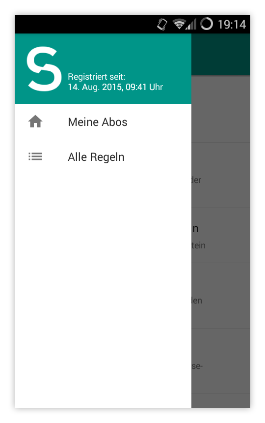
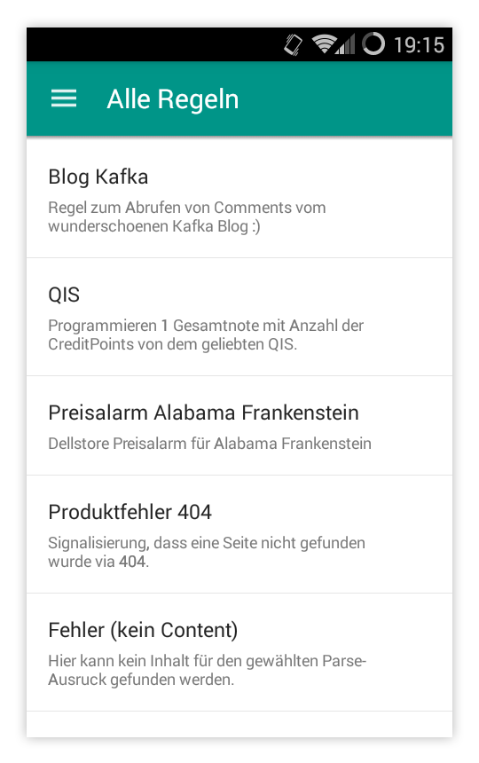
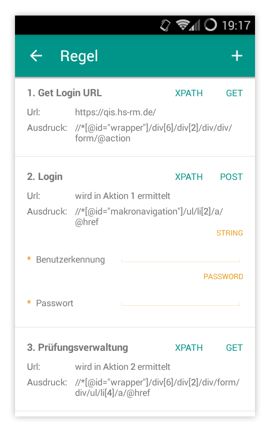
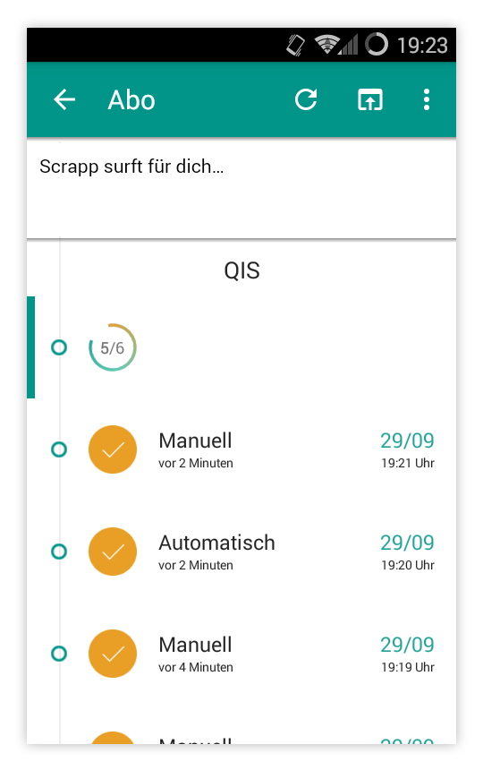

# Scrapp

Scrapp is an Android app developed by Tilman Ginzel, Rahel Habacker and Jonas Theis during our studies
at the RheinMain University of Applied Sciences. The development took place in a fifth semester course called *Mobile
Computing* lectured by Prof. Dr. Peter Barth in summer 2015.

The apps purpose is to notify its users about specific content changes on any website via push-notifications. To do so, it simulates a browser which follows a sequence of URLs and extracts the desired content with XPATH or CSS-Queries (web scraping). The content will be hashed and compared to an older state, to check if it has changed.

One major feature is that multiple users can subscribe to a specific *Rule* (sequence of URLs) and thereby share the effort of regular polling for content changes. The user can configure a time interval, describing the points in time when the app should automatically poll in the background. If new content is found, every subscriber will be notified. A server is used to share this information with other interested users. For security and privacy concerns it is important to mention that only hashes and no content will be shared.

A full description of the process, possible use cases and implementation details can be found in the [documentation](scrapp-documentation.pdf) (pdf, german).

See [scrapp-server](https://github.com/tilmanginzel/scrapp-server/) for the backend implementation.

## Screenshots

